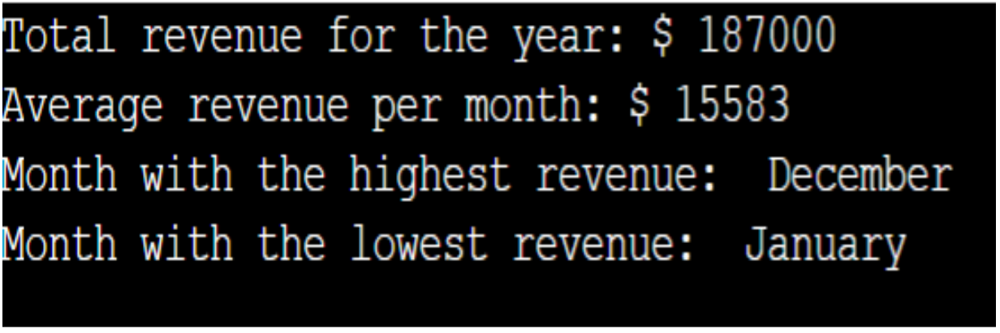

# FUNCTIONS AND LOOPS ACTIVITY

## Activity: Data Analysis

## Poblem statement:
Write a Python program that analyze and generate some statistics over sales data for the past year.
It is stored in a list of tuples, where each tuple contains the sales revenue for a particular month.
Specifically, your program should:

- Calculate the total revenue for the year.
- Calculate the average revenue per month.
- Find the month with the highest revenue.
- Find the month with the lowest revenue.

## INSTRUCTIONS:

1. Define a list of tuples containing the sales revenue for each month. You can use the following
example data:
sales_data = [(10000, "January"), (15000, "February"), (12000, "March"), (18000, "April"),
(20000, "May"),(14000, "June"), (16000, "July"), (17000, "August"), (13000, "September"),
(11000, "October"),(19000, "November"), (22000, "December")]

2. Create four variables to store the total revenue, average revenue per month, month with the
highest revenue, and month with the lowest revenue.

3. Use a loop to iterate over the list of tuples and update the total revenue variable.

4. Define a function called average_revenue that takes total revenue as input then return the round
off value of average revenue per month. The formula to calculate the average revenue per month
is dividing the total revenue by 12 then use round() function.

5. Use a loop to iterate over the list of tuples and compare the revenue for each month to the current
highest and lowest revenue. Update the month with the highest and lowest revenue accordingly.

6. Print out the total revenue, average revenue per month, month with the highest revenue, and
month with the lowest revenue in a readable format.

## EXAMPLE OUTPUT:

