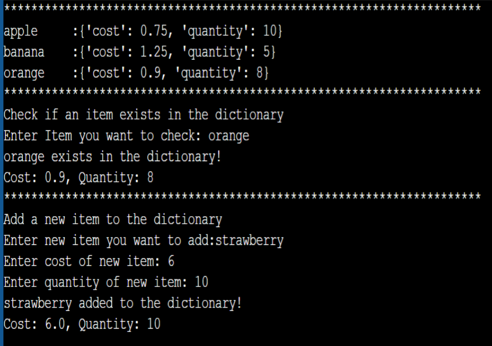

# REVIEW ACTIVITY

Create a program that stores information about the cost and quantity of each item, using the item
name as the key and a nested dictionary as the value. The if statement is used to check if a particular
item exists in the dictionary, and the else statement is used to add a new item to the dictionary if it
doesn't already exist.

1. Create an empty dictionary for storing item, costs and quantities
2. Add some items to the dictionary
3. Use input function to ask user what item was being searched
4. Use if else to Check if an item exists in the dictionary
5. Use if else to Check if the new item inputted by the user already exists if not proceed in Adding a new item, cost and quantity to the dictionary.

The item you inputted must be related to your program

Here is an example of the output:

